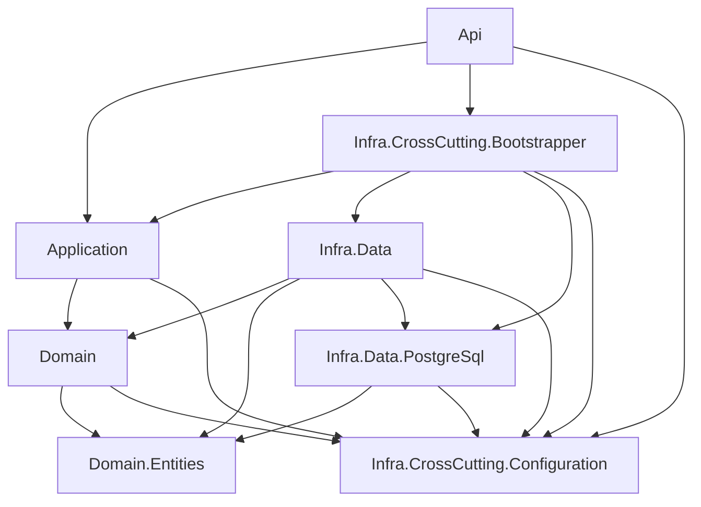

# IN-001: Camadas Canonicas de um Bounded Context

## Status

Aceita

## Contexto

### O Problema (Analogia)

Imagine um restaurante onde a cozinha, o estoque e a area de atendimento
nao tem divisorias claras. Qualquer cozinheiro pode ir direto ao
fornecedor, qualquer garcom pode mexer nas panelas, e ninguem sabe onde
termina uma responsabilidade e comeca outra. Agora imagine que cada area
tem um nome fixo, uma porta de entrada bem definida e regras claras de
quem acessa o que. O restaurante funciona com previsibilidade.

### O Problema Tecnico

Em projetos DDD com multiplos bounded contexts, a falta de uma
convencao rigida para nomear e organizar camadas de infraestrutura
gera problemas:

1. **Inconsistencia entre BCs**: Cada bounded context inventa sua
   propria estrutura de projetos (ex: `Persistence`, `DataAccess`,
   `Infrastructure.Data`).
2. **Confusao entre abstracoes e implementacoes**: Sem separacao clara,
   repositorios abstratos e implementacoes especificas de tecnologia
   ficam no mesmo projeto.
3. **Dificuldade de troca de tecnologia**: Quando tudo esta acoplado em
   um unico projeto `Persistence`, trocar PostgreSQL por outro provider
   exige refatoracao massiva.
4. **Code agents perdidos**: LLMs nao tem uma convencao a seguir e
   geram projetos com nomes diferentes a cada iteracao.

## Como Normalmente É Feito

### Abordagem 1: O Copia-e-Cola de Pastas

A abordagem mais comum é copiar a estrutura de outro projeto (ou de um
template generico) e renomear pastas. Cada bounded context vira uma
variacao improvisada:

```
# BC de Auth — alguem copiou de um tutorial
Auth/
  Domain/
  Application/
  Infrastructure/         # tudo junto
    Repositories/
    DbContext.cs
    Migrations/
    EmailService.cs
    CacheService.cs

# BC de Catalog — outra pessoa copiou de outro projeto
Catalog/
  Core/                   # "Domain" com outro nome
  Services/               # "Application" com outro nome
  Persistence/            # "Infrastructure" com outro nome
    Data/
    Cache/

# BC de Orders — terceiro dev, terceira convencao
Orders/
  Models/                 # entidades misturadas com DTOs
  DataAccess/             # repositorios + DbContext + migrations
  Handlers/               # use cases misturados com infra
```

**O que acontece na pratica:**

- Cada BC inventa sua propria nomenclatura. Nao existe um padrao para
  saber se persistencia fica em `Infrastructure`, `Persistence`,
  `DataAccess` ou `Data`.
- Ao copiar pastas, copiam-se tambem dependencias desnecessarias,
  usings errados e padroes obsoletos do projeto de origem.
- Code agents (LLMs) recebem contextos inconsistentes e geram codigo
  com nomes diferentes a cada iteracao.
- Novos desenvolvedores perdem tempo tentando entender a "logica" por
  tras de cada variacao — que na verdade nao tem logica nenhuma, so
  historico de copias.

### Por Que Nao Funciona Bem

- Nao ha separacao entre abstracoes de dados e implementacoes
  especificas de tecnologia.
- Trocar o banco de dados exige mexer no mesmo projeto que contem
  logica de cache, email e outros servicos.
- O Dependency Inversion Principle é violado porque camadas superiores
  referenciam diretamente o projeto que contem implementacoes concretas.
- Em monorepos com multiplos BCs, cada equipe cria sua propria
  convencao — e nenhuma é compativel com a outra.

### Abordagem 2: Vertical Slicing

O Vertical Slice Architecture organiza o codigo por feature em vez de
por camada. Cada slice contem tudo: handler, validacao, acesso a dados,
resposta:

```
Features/
  RegisterUser/
    RegisterUserCommand.cs
    RegisterUserHandler.cs      # recebe o request, valida, persiste, retorna
    RegisterUserValidator.cs
    RegisterUserResponse.cs
  AuthenticateUser/
    AuthenticateUserQuery.cs
    AuthenticateUserHandler.cs
    AuthenticateUserValidator.cs
    AuthenticateUserResponse.cs
```

**O apelo do vertical slicing** é real: visao centralizada da feature,
facilidade de navegacao, baixo acoplamento entre features. Em times
maduros com alto conhecimento arquitetural, cada individuo consegue
manter a disciplina de nao violar limites de camada no dia a dia.

### Por Que Vertical Slicing Nao É Adotado Aqui

O problema fundamental do vertical slicing é que **cada slice tem
acesso a tudo**. O handler é a camada que orquestra, e por definicao
ela enxerga desde o payload da API ate o banco de dados:

```csharp
// Vertical slice — o handler VE tudo
public class RegisterUserHandler
{
    private readonly DbContext _db;  // acesso direto ao banco

    public async Task Handle(RegisterUserCommand cmd)
    {
        // Nada impede este codigo:
        var entity = new UserEntity
        {
            Email = cmd.Email,        // payload da API direto na entidade
            Password = cmd.Password   // sem hashing, sem validacao de dominio
        };
        _db.Users.Add(entity);        // direto ao banco, ignorando o dominio
        await _db.SaveChangesAsync();
    }
}
```

Em uma aplicacao OLTP, isso é perigoso: o dominio é completamente
ignorado. Regras de negocio (validacao de email, politica de senha,
hashing, eventos de dominio) sao bypassadas porque nao existe
nenhum guardrail arquitetural que impeca o handler de ir direto ao
banco.

**A questao nao é se alguem "faria isso de proposito"** — é que o
compilador permite. Em um time de 5 pessoas, talvez todos tenham
disciplina. Em um time de 20, com pressao de prazo, com juniors, com
code agents gerando codigo, a probabilidade de alguem tomar esse
atalho é alta. E o vertical slicing nao oferece nenhuma protecao
estrutural contra isso.

**A abordagem do Bedrock é diferente:**

- Camadas horizontais com dependencias unidirecionais garantem que a
  **Application nao consegue referenciar `Infra.Data.PostgreSql`** —
  o compilador impede.
- Cada camada so conhece a imediatamente abaixo via abstracao. A
  Application fala com `IUserRepository` (Domain), nao com
  `DbContext` (Infra).
- Comportamentos sao injetados via IoC no Bootstrapper: a Application
  recebe uma implementacao de `IUserRepository` sem saber se por tras
  ha PostgreSQL, Redis, ou um mock de teste.
- Em vez de uma grande camada Facade (o slice) que orquestra tudo,
  **camadas especializadas** com responsabilidades bem delimitadas
  garantem que violacoes sao erros de compilacao, nao erros de review.

> **Resumo**: Vertical slicing troca guardrails de compilacao por
> disciplina humana. O Bedrock opta por tornar violacoes arquiteturais
> impossiveis em tempo de compilacao, independente da maturidade do
> time.

## A Decisao

### Nossa Abordagem

Todo bounded context no Bedrock DEVE seguir a estrutura canonica
de camadas abaixo:

| Camada | Projeto | Responsabilidade |
|--------|---------|-----------------|
| Domain.Entities | `{BC}.Domain.Entities` | Entidades, value objects, aggregates |
| Domain | `{BC}.Domain` | Interfaces de repositorio, servicos de dominio |
| Application | `{BC}.Application` | Casos de uso, orquestracao, application services |
| Infra.Data | `{BC}.Infra.Data` | Implementacao abstrata de repositorios (`RepositoryBase`), adaptadores |
| Infra.Data.{Tech} | `{BC}.Infra.Data.PostgreSql` | Implementacao especifica de tecnologia (connections, data models, unit of work) |
| Infra.CrossCutting.Configuration | `{BC}.Infra.CrossCutting.Configuration` | Modelos de configuracao, acesso a configs externas (appsettings, env vars, secrets) |
| Infra.CrossCutting.Bootstrapper | `{BC}.Infra.CrossCutting.Bootstrapper` | IoC, DI, composicao de dependencias |

**Regra de acesso a Configuration**: Todos os projetos do BC podem
referenciar `Infra.CrossCutting.Configuration`. Ele centraliza os
modelos de configuracao (options/settings classes) e o acesso a fontes
externas, evitando que cada camada defina seus proprios modelos de config.

**Estrutura de diretorios (exemplo para `ShopDemo.Auth`):**

```
src/ShopDemo/Auth/
  Domain.Entities/
    ShopDemo.Auth.Domain.Entities.csproj
  Domain/
    ShopDemo.Auth.Domain.csproj
  Application/
    ShopDemo.Auth.Application.csproj
  Infra.Data/
    ShopDemo.Auth.Infra.Data.csproj
  Infra.Data.PostgreSql/
    ShopDemo.Auth.Infra.Data.PostgreSql.csproj
  Infra.CrossCutting.Configuration/          # futuro
    ShopDemo.Auth.Infra.CrossCutting.Configuration.csproj
  Infra.CrossCutting.Bootstrapper/           # futuro
    ShopDemo.Auth.Infra.CrossCutting.Bootstrapper.csproj
```

**Grafo de dependencias:**



### Por Que Funciona Melhor

- **Nomenclatura previsivel**: Qualquer code agent ou desenvolvedor
  sabe exatamente onde encontrar e criar cada tipo de artefato.
- **Separacao de abstracoes e implementacoes**: `Infra.Data` contem
  `RepositoryBase` e adaptadores; `Infra.Data.PostgreSql` contem
  connections, data models e unit of work especificos.
- **Troca de tecnologia isolada**: Para suportar MongoDB, basta criar
  `Infra.Data.MongoDB` sem tocar em `Infra.Data`.
- **Alinhamento com templates**: O diretorio `src/Templates/` do
  Bedrock segue exatamente esta convencao.

## Consequencias

### Beneficios

- Consistencia entre todos os bounded contexts do monorepo.
- Code agents geram projetos com nomes corretos sem ambiguidade.
- Dependency Inversion respeitado: camadas superiores dependem de
  `Infra.Data` (abstracoes), nao de `Infra.Data.PostgreSql`.
- Facilita onboarding: novos desenvolvedores entendem a estrutura
  imediatamente.

### Trade-offs (Com Perspectiva)

- **Mais projetos por BC**: Um BC completo tera 5-7 projetos ao inves
  de 2-3. Na pratica, isso adiciona poucos segundos ao tempo de build
  e o ganho em organizacao compensa amplamente.
- **Nomes longos**: `ShopDemo.Auth.Infra.Data.PostgreSql` é verboso,
  mas a previsibilidade e clareza compensam. IDEs e code agents lidam
  bem com nomes longos.

## Fundamentacao Teorica

### Padroes de Design Relacionados

- **Repository Pattern** (Fowler, POEAA): A separacao entre
  `Infra.Data` e `Infra.Data.{Tech}` implementa o Repository Pattern
  com uma camada adicional de abstracao.
- **Adapter Pattern** (GoF): `Infra.Data` atua como adaptador entre
  as interfaces do dominio e as implementacoes tecnologicas.

### O Que o DDD Diz

> "The infrastructure layer is where the technical implementation of
> repository interfaces lives."
>
> *A camada de infraestrutura é onde vive a implementacao tecnica das
> interfaces de repositorio.*

Evans (2003) separa claramente Domain (interfaces) de Infrastructure
(implementacoes). Nossa decisao refina isso com uma camada intermediaria
(`Infra.Data`) que contem abstracoes reutilizaveis.

### O Que o Clean Architecture Diz

> "Source code dependencies must point only inward, toward
> higher-level policies."
>
> *Dependencias de codigo-fonte devem apontar apenas para dentro, em
> direcao a politicas de nivel mais alto.*

Robert C. Martin (2017). A separacao `Infra.Data` / `Infra.Data.{Tech}`
garante que a camada abstrata nao depende da tecnologia especifica — a
Dependency Rule é respeitada.

## Aprenda Mais

### Perguntas Para Fazer a LLM

1. "Por que separar `Infra.Data` de `Infra.Data.PostgreSql` ao inves
   de colocar tudo em um unico projeto?"
2. "Como adicionar suporte a um novo banco de dados (ex: MongoDB)
   seguindo esta convencao?"
3. "Qual a diferenca entre `Infra.Data` e `Domain` em termos de
   responsabilidade?"

### Leitura Recomendada

- Eric Evans, *Domain-Driven Design* (2003), Cap. 5 — Layered Architecture
- Robert C. Martin, *Clean Architecture* (2017), Cap. 22 — The Clean Architecture
- Vaughn Vernon, *Implementing Domain-Driven Design* (2013), Cap. 4 — Architecture

## Building Blocks Correlacionados

| Building Block | Relacao com a ADR |
|----------------|-------------------|
| Bedrock.BuildingBlocks.Data | Framework base para camada `Infra.Data` (RepositoryBase, DataModelBase) |
| Bedrock.BuildingBlocks.Persistence.PostgreSql | Framework base para camada `Infra.Data.PostgreSql` (connections, unit of work) |

## Referencias no Codigo

- Template de referencia: `src/Templates/Infra.Data.PostgreSql/`
- Implementacao de exemplo: `src/ShopDemo/Auth/Infra.Data.PostgreSql/`
- Camada abstrata de exemplo: `src/ShopDemo/Auth/Infra.Data/`
