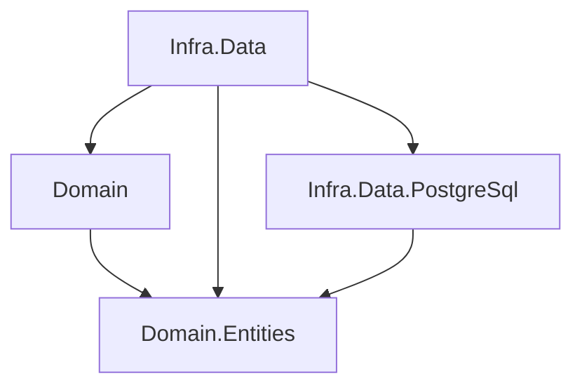

# IN-003: Domain É um Projeto Separado de Domain.Entities

## Status

Aceita

## Contexto

### O Problema (Analogia)

Imagine um hospital. O catalogo de medicamentos (nomes, composicoes,
dosagens) é uma referencia compartilhada — todos os departamentos
consultam. Mas as regras de prescricao (quem pode prescrever, quando
prescrever, interacoes medicamentosas) sao responsabilidade exclusiva
da equipe medica. Se voce misturar o catalogo com as regras de
prescricao no mesmo documento, a farmacia que so precisa consultar nomes
e dosagens acaba tendo que carregar todas as regras medicas. Separar o
catalogo das regras permite que cada departamento use apenas o que
precisa.

### O Problema Tecnico

Com entidades isoladas em Domain.Entities ([IN-002](./IN-002-domain-entities-projeto-separado.md)),
surge a questao: onde ficam as interfaces de repositorio, os domain
services e as especificacoes?

Se ficam em Domain.Entities, o projeto acumula responsabilidades demais
e todas as camadas de infra ganham visibilidade de contratos que nao
lhes dizem respeito. Se ficam em um projeto `Domain` que tambem contem
entidades, voltamos ao problema original da IN-002.

A solucao é um projeto `{BC}.Domain` separado que contem exclusivamente
artefatos de dominio que nao sao entidades.

## Como Normalmente É Feito

### Abordagem Tradicional

Na maioria dos projetos DDD, tudo vive em um unico projeto Domain:

```
Domain/
  Entities/
    User.cs
  ValueObjects/
    Email.cs
  Interfaces/
    IUserRepository.cs
  Services/
    AuthenticationService.cs
  Specifications/
    ActiveUserSpecification.cs
```

### Por Que Nao Funciona Bem

- `Infra.Data.PostgreSql` precisa de `User` para criar factories e
  adapters, mas ao referenciar Domain ganha visibilidade de
  `IUserRepository` e `AuthenticationService`.
- O Dependency Inversion Principle fica confuso: o Domain define as
  interfaces, mas as camadas de infra que as implementam tambem
  dependem de Domain — criando uma dependencia circular conceitual.
- Domain services que nao deveriam ser visiveis para camadas de infra
  ficam expostos sem necessidade.

## A Decisao

### Nossa Abordagem

O projeto `{BC}.Domain` é separado de `{BC}.Domain.Entities` e contem:

- **Interfaces de repositorio** (ex: `IUserRepository`)
- **Domain services** (ex: `AuthenticationService`)
- **Especificacoes** (ex: `ActiveUserSpecification`)

```
samples/ShopDemo/Auth/
  Domain.Entities/
    Users/
      User.cs
    ValueObjects/
      Email.cs
  Domain/
    ShopDemo.Auth.Domain.csproj
    Repositories/
      Interfaces/
        IUserRepository.cs
    Services/
      AuthenticationService.cs
```

**Regras fundamentais:**

1. **Domain depende apenas de Domain.Entities** (e opcionalmente de
   Configuration).
2. **Interfaces de repositorio vivem no Domain** — Dependency Inversion
   Principle: quem define o contrato é o dominio, nao a infraestrutura.
3. **Domain services interagem com repositorios via abstracao**: usam
   `IUserRepository`, nunca `UserPostgreSqlRepository`.
4. **Parametros e retornos sao sempre entidades/VOs**: Domain so fala
   em vocabulario de dominio. Nunca recebe ou retorna DataModels, DTOs
   de infra, ou tipos especificos de tecnologia.

**Grafo de dependencias relevante:**



### Por Que Funciona Melhor

- **Dependency Inversion respeitado**: O dominio define os contratos
  (`IUserRepository`), a infraestrutura os implementa. A seta de
  dependencia aponta para dentro (dominio), nunca para fora (infra).
- **Infra.Data.{Tech} nao conhece Domain**: Camadas tecnologicas
  dependem apenas de Domain.Entities, sem visibilidade de domain
  services ou interfaces de repositorio.
- **Separacao de preocupacoes**: Entidades sao dados + regras locais;
  Domain sao contratos + orquestracao de regras entre entidades.
- **Previsibilidade**: Code agents sabem que interface de repositorio
  vai em Domain, entidade vai em Domain.Entities.

## Consequencias

### Beneficios

- `Infra.Data.PostgreSql` referencia apenas Domain.Entities — sem
  dependencia desnecessaria de domain services.
- Domain services podem evoluir sem recompilar camadas de infra.
- Contratos de repositorio sao claramente do dominio, nao da infra.
- Separacao clean entre "o que o BC sabe" (entidades) e "o que o BC
  faz" (services, especificacoes).

### Trade-offs (Com Perspectiva)

- **Dois projetos Domain**: `Domain.Entities` e `Domain` podem parecer
  redundantes. Na pratica, a separacao é clara: entidades vs.
  contratos/servicos. A convencao de nomes elimina ambiguidade.
- **Import adicional**: Projetos que precisam de entidades E interfaces
  referenciam dois projetos. O custo é minimo e IDEs resolvem
  automaticamente.

## Fundamentacao Teorica

### Padroes de Design Relacionados

- **Dependency Inversion Principle** (SOLID): O Domain define as
  abstracoes (interfaces de repositorio); a infraestrutura depende
  dessas abstracoes, nao o contrario.
- **Separated Interface** (Fowler, POEAA): Interfaces vivem em um
  pacote diferente das implementacoes, permitindo que clientes dependam
  apenas do contrato.

### O Que o DDD Diz

> "Repository interfaces belong in the domain layer."
>
> *Interfaces de repositorio pertencem a camada de dominio.*

Evans (2003) é explicito: o contrato do repositorio é parte do dominio
porque expressa o que o dominio precisa para funcionar. A implementacao
é detalhe de infraestrutura.

### O Que o Clean Architecture Diz

> "Source code dependencies must point only inward."
>
> *Dependencias de codigo-fonte devem apontar apenas para dentro.*

Robert C. Martin (2017). Com Domain definindo interfaces e Infra.Data
implementando-as, a Dependency Rule é respeitada: infra depende de
dominio, nunca o contrario.

## Aprenda Mais

### Perguntas Para Fazer a LLM

1. "Por que interfaces de repositorio ficam no Domain e nao em
   Infra.Data?"
2. "Qual a diferenca entre um domain service e um application service?"
3. "Como o Dependency Inversion Principle se aplica a camadas de
   persistencia?"

### Leitura Recomendada

- Eric Evans, *Domain-Driven Design* (2003), Cap. 6 — Domain Layer,
  Repositories
- Robert C. Martin, *Clean Architecture* (2017), Cap. 22 — The Clean
  Architecture
- Martin Fowler, *Patterns of Enterprise Application Architecture*
  (2002), Cap. 18 — Separated Interface

## Building Blocks Correlacionados

| Building Block | Relacao com a ADR |
|----------------|-------------------|
| Bedrock.BuildingBlocks.Domain.Entities | Framework base que Domain.Entities referencia |
| Bedrock.BuildingBlocks.Data | Framework base para Infra.Data, que implementa interfaces definidas no Domain |

## Referencias no Codigo

- Implementacao de exemplo: `samples/ShopDemo/Auth/Domain/`
- Interface de repositorio: `samples/ShopDemo/Auth/Domain/Repositories/Interfaces/IUserRepository.cs`
- ADR relacionada: [IN-002 — Domain.Entities Projeto Separado](./IN-002-domain-entities-projeto-separado.md)
- ADR relacionada: [IN-001 — Camadas Canonicas de um Bounded Context](./IN-001-camadas-canonicas-bounded-context.md)
