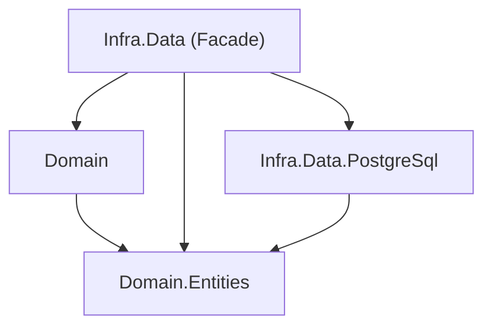

# IN-005: Infra.Data Atua como Facade de Persistencia

## Status

Aceita

## Validacao Automatizada

Esta ADR e **informativa** — documenta decisoes de design, nao possui
rule de arquitetura propria. As restricoes de dependencia que ela
descreve ja sao cobertas pelas rules existentes:

- **IN-001**: Valida o grafo canonico de dependencias entre camadas
  (`Infra.Data` -> `Domain`, `Domain.Entities`, `Infra.Data.{Tech}`).
- **IN-003**: Garante que `Domain` nao referencia `Infra.Data`.

As demais diretrizes (Facade pattern, orquestracao de tecnologias,
nomenclatura de negocio em vez de CRUD) sao convencoes de implementacao
interna da camada `Infra.Data` que nao se traduzem em constraints de
ProjectReference/PackageReference.

## Contexto

### O Problema (Analogia)

Imagine uma agencia de viagens. O cliente diz "quero ir para Paris na
segunda semana de julho". Ele nao diz "reserve o voo TAM 3421, o hotel
Marriott quarto 502, e o transfer da empresa XYZ". A agencia recebe o
pedido de alto nivel e decide internamente qual companhia aerea, qual
hotel e qual transfer usar. Se o cliente tivesse que lidar com cada
fornecedor diretamente, a complexidade seria enorme. A agencia é uma
fachada que simplifica a interacao.

### O Problema Tecnico

Com entidades isoladas ([IN-002](./IN-002-domain-entities-projeto-separado.md)),
contratos no Domain ([IN-003](./IN-003-domain-projeto-separado.md)) e
DataModels nas camadas tecnologicas ([IN-004](./IN-004-modelo-dados-detalhe-implementacao.md)),
surge a questao: quem implementa as interfaces de repositorio definidas
no Domain?

Se `Infra.Data.PostgreSql` implementar diretamente `IUserRepository`,
o Domain passa a depender de uma tecnologia especifica. Se a aplicacao
precisar de cache-aside (Redis + PostgreSQL), quem orquestra a
estrategia? Se uma operacao de negocio precisar buscar em dois bancos
diferentes, quem decide a ordem?

## Como Normalmente É Feito

### Abordagem 1: Service Orquestrando Repositorios Tecnologicos

A abordagem mais estruturada cria repositorios por tecnologia e um
service que orquestra as chamadas. O problema é que a orquestracao
fica no Application ou no Domain — camadas que nao deveriam conhecer
detalhes de infraestrutura:

```csharp
// Repositorio PostgreSQL — CRUD generico
public class UserPostgreSqlRepository : IUserPostgreSqlRepository
{
    private readonly NpgsqlConnection _connection;

    public Task<User> GetById(Guid id) { ... }
    public Task Insert(User user) { ... }
    public Task Update(User user) { ... }
}

// Repositorio Redis — cache generico
public class UserRedisRepository : IUserRedisRepository
{
    private readonly IConnectionMultiplexer _redis;

    public Task<User?> Get(string key) { ... }
    public Task Set(string key, User user, TimeSpan ttl) { ... }
    public Task Invalidate(string key) { ... }
}

// Application Service — orquestra as tecnologias
public class AuthenticationService
{
    private readonly IUserPostgreSqlRepository _postgreSql;
    private readonly IUserRedisRepository _redis;

    public async Task<User> GetUserForAuthentication(string email)
    {
        // Cache-aside: tenta o cache primeiro
        var cached = await _redis.Get($"user:{email}");
        if (cached is not null)
            return cached;

        // Miss: busca no banco
        var user = await _postgreSql.GetByEmail(email);

        // Popula o cache
        await _redis.Set($"user:{email}", user, TimeSpan.FromMinutes(5));
        return user;
    }
}
```

O Application Service agora sabe que existe PostgreSQL e Redis, conhece
a estrategia de cache-aside, monta chaves de cache e define TTLs. A
camada de aplicacao — que deveria orquestrar regras de negocio — esta
tomando decisoes de infraestrutura.

### Abordagem 2: Acesso Direto ao Client

Em projetos com menos estrutura, é comum o service acessar o client
da tecnologia diretamente — sem nem mesmo uma abstracao de repositorio:

```csharp
// Application Service — acesso direto ao banco e ao cache
public class AuthenticationService
{
    private readonly NpgsqlConnection _db;
    private readonly IConnectionMultiplexer _redis;

    public async Task<User> GetUserForAuthentication(string email)
    {
        // SQL direto no service
        var redisDb = _redis.GetDatabase();
        var cached = await redisDb.StringGetAsync($"user:{email}");
        if (cached.HasValue)
            return JsonSerializer.Deserialize<User>(cached!);

        // Query SQL inline
        using var cmd = new NpgsqlCommand(
            "SELECT id, email, hashed_password FROM users WHERE email = @email",
            _db);
        cmd.Parameters.AddWithValue("email", email);

        using var reader = await cmd.ExecuteReaderAsync();
        // ... materializa o User manualmente

        // Popula o cache com serializacao manual
        await redisDb.StringSetAsync(
            $"user:{email}",
            JsonSerializer.Serialize(user),
            TimeSpan.FromMinutes(5));

        return user;
    }
}
```

Aqui o acoplamento é total: o Application Service conhece o driver
(`NpgsqlConnection`), a API do Redis (`StringGetAsync`), a estrutura
das tabelas (`SELECT ... FROM users`), o formato de serializacao e a
estrategia de cache. Trocar qualquer tecnologia exige reescrever o
service inteiro.

### Por Que Nao Funciona Bem

- **Abordagem 1**: A orquestracao de tecnologias vaza para a Application.
  O service de negocio precisa conhecer `IUserPostgreSqlRepository` e
  `IUserRedisRepository` — interfaces tecnologicas que nao deveriam ser
  visiveis acima da camada de dados.
- **Abordagem 2**: Acoplamento direto com drivers e APIs de tecnologia.
  Qualquer mudanca de infra (trocar Redis por Memcached, mudar o schema
  da tabela) impacta diretamente o service de negocio.
- **Ambas**: Operacoes sao CRUD generico — `GetById`, `Insert`,
  `Update`. Nao expressam intencao de negocio. `GetById` nao diz se é
  para autenticacao, para exibicao de perfil ou para auditoria — cada
  caso pode ter necessidades diferentes de dados e estrategias de cache
  diferentes.
- **Ambas**: Decisoes de infraestrutura (qual tecnologia usar, qual
  estrategia de cache, qual TTL) ficam espalhadas pela aplicacao em
  vez de centralizadas em um unico ponto.
- **Ambas**: Trocar ou adicionar uma tecnologia exige alterar todas as
  camadas que a referenciam — impacto em toda a aplicacao.

### "Mas o Codigo Simples Nao Esta Ruim"

Alguem lendo o exemplo da Abordagem 2 — Redis e PostgreSQL no mesmo
metodo — pode pensar: "esse codigo é simples, esta tudo em um lugar
so, é facil de ler e diagnosticar. Por que separar?"

Esse argumento nao é invalido. Existem contextos onde ele funciona
bem:

- **Projetos com poucas relacoes entre objetos e regras de negocio
  simples**: Quando o dominio é enxuto, a complexidade nao justifica
  camadas adicionais.
- **Ambientes altamente regulados**: Setores com forte governanca,
  documentacao extensa e processos de mudanca controlados. Nesse
  contexto, cada alteracao é planejada, revisada e documentada — o
  risco de inconsistencia é baixo porque o processo compensa a falta
  de guardrails arquiteturais.
- **Projetos solo**: Quando uma unica pessoa desenvolve e mantem o
  sistema, tudo esta fresco na mente. Nao ha risco de alguem alterar
  um fluxo sem saber que outro fluxo depende da mesma regra.
- **Projetos com pouco motivo de mudanca**: Sistemas que nascem, vivem
  e morrem sem muita alteracao pos-criacao. Se o codigo raramente muda,
  a separacao de responsabilidades tem menos valor pratico.

Para essas pessoas, toda essa separacao de camadas no acesso a dados é
custosa, tira a clareza e espalha logica que "poderia estar junta".

**Porem, a maioria dos cenarios enterprise nao se encaixa nesses
perfis.** A realidade da maioria dos projetos corporativos é:

- **Nao sao altamente regulados**: Documentacao é negligenciada,
  decisoes arquiteturais nao sao registradas, conhecimento vive na
  cabeca de quem implementou.
- **Rotatividade enorme de profissionais**: A pessoa que escreveu o
  codigo saiu da empresa ha 6 meses. Quem vai alterar nao sabe o
  todo, nao sabe quais fluxos dependem daquele trecho, nao sabe por
  que aquela regra existe.
- **Prazos apertados**: Sob pressao de entrega, o caminho mais curto
  é o mais tentador. Se o codigo permite ir direto ao banco sem
  passar pelo dominio, alguem vai fazer isso.
- **Quantidade enorme de fluxos e integracoes**: O mesmo `User` é
  criado via tela de cadastro, importacao de CSV, integracao com ERP,
  webhook de parceiro e migracao de sistema legado. Cada fluxo é
  implementado por uma pessoa diferente, em momentos diferentes.

**Sem camadas bem definidas, o resultado é previsivel**: na importacao
do CSV, o campo `TenantId` é preenchido porque o dev que implementou
sabia da regra. No cadastro pela tela, nao é — porque outro dev nao
sabia. O campo `LastLoginAt` é atualizado na autenticacao via API, mas
nao na autenticacao via SSO. Regras de negocio que deveriam ser
universais ficam espalhadas e inconsistentes porque cada ponto de
entrada reimplementa (ou esquece) a logica.

**Para esse tipo de cenario — que é o foco deste projeto** — camadas
e objetos com responsabilidades bem definidas sao essenciais para que
o sistema se mantenha saudavel ao longo de um ciclo de vida longo, com
diversas pessoas passando por ali, cada modificacao feita por alguem
que nao conhece o todo, e multiplos fluxos externos convergindo em
regras de negocio compartilhadas.

## A Decisao

### Nossa Abordagem

`{BC}.Infra.Data` atua como uma Facade de persistencia que:

1. **Implementa as interfaces de repositorio** definidas no Domain.
2. **Orquestra as tecnologias especificas** (PostgreSQL, Redis, etc.).
3. **Expoe operacoes de negocio** (high-level), nao CRUD (low-level).

```
src/ShopDemo/Auth/
  Domain/
    Repositories/
      Interfaces/
        IUserRepository.cs           # Contrato de negocio

  Infra.Data/
    Repositories/
      UserRepository.cs              # Facade — implementa IUserRepository
                                     # Orquestra Infra.Data.PostgreSql (e futuro Redis, etc.)

  Infra.Data.PostgreSql/
    Repositories/
      Interfaces/
        IUserPostgreSqlRepository.cs # Contrato tecnologico
      UserPostgreSqlRepository.cs    # Implementacao PostgreSQL pura
```

**Operacoes de negocio vs. CRUD:**

```csharp
// Domain — interface de negocio (high-level)
public interface IUserRepository
{
    Task<User> GetUserForAuthenticationAsync(Email email);
    Task RegisterNewUserAsync(User user);
}

// Infra.Data — Facade que orquestra tecnologias
public class UserRepository : IUserRepository
{
    private readonly IUserPostgreSqlRepository _postgreSql;
    // futuro: private readonly IUserRedisRepository _redis;

    public async Task<User> GetUserForAuthenticationAsync(Email email)
    {
        // Estrategia: busca direto no OLTP (autenticacao é critica)
        return await _postgreSql.GetByEmailAsync(email);
    }

    public async Task RegisterNewUserAsync(User user)
    {
        // Estrategia: persiste no OLTP
        await _postgreSql.AddAsync(user);
    }
}

// Infra.Data.PostgreSql — implementacao tecnologica (low-level)
public class UserPostgreSqlRepository : IUserPostgreSqlRepository
{
    public Task<User> GetByEmailAsync(Email email) { ... }
    public Task AddAsync(User user) { ... }
}
```

**Regras fundamentais:**

1. **Domain nunca diz como persistir**: Diz "registra este usuario" e
   pronto. Nao diz "persiste no PostgreSQL" ou "invalida o cache".
2. **Infra.Data implementa as interfaces do Domain**: É o unico projeto
   que implementa `IUserRepository`.
3. **Infra.Data orquestra as tecnologias**: Decide a estrategia de
   persistencia para cada operacao (cache-aside, write-through,
   fallback, etc.).
4. **Operacoes sao de negocio**: `RegisterNewUser`, `GetUserForAuthentication`
   — nao `Insert`, `GetById`.
5. **Cada operacao pode ter sua propria estrategia**: Autenticacao busca
   direto no OLTP; listagem pode usar cache; registro pode invalidar
   cache apos escrita.

**Grafo de dependencias:**



### Por Que Funciona Melhor

- **Facade Pattern**: Simplifica a interacao com multiplas tecnologias
  atras de uma interface unica.
- **Estrategia por operacao**: Cada operacao de negocio pode ter sua
  propria logica de persistencia, sem impactar o dominio.
- **Troca de tecnologia transparente**: Adicionar Redis como cache é
  invisivel para o Domain — so a Facade muda.
- **Operacoes expressivas**: Metodos de repositorio comunicam intencao
  de negocio, facilitando compreensao e manutencao.

## Consequencias

### Beneficios

- Domain depende apenas de abstracoes de negocio — zero conhecimento de
  tecnologia.
- Adicionar ou trocar tecnologias de persistencia nao impacta o Domain
  nem a Application.
- Operacoes de repositorio sao auto-documentadas pela nomenclatura de
  negocio.
- Estrategias de persistencia complexas (cache-aside, CQRS, event
  sourcing) ficam encapsuladas na Facade.
- Code agents geram repositorios com nomenclatura de negocio em vez de
  CRUD generico.

### Trade-offs (Com Perspectiva)

- **Camada extra**: Infra.Data entre Domain e Infra.Data.PostgreSql
  adiciona uma indirection. Na pratica, a Facade é uma classe fina que
  delega para a tecnologia — o overhead de codigo é minimo.
- **Mais interfaces**: `IUserRepository` (negocio) +
  `IUserPostgreSqlRepository` (tecnico) para a mesma entidade. A
  separacao é justificada: uma expressa o que o negocio precisa, a
  outra o que a tecnologia oferece.
- **Nomenclatura de negocio exige analise**: Definir
  `GetUserForAuthentication` em vez de `GetById` requer pensar na
  intencao. Esse "custo" é na verdade um beneficio — forca o
  entendimento do dominio.

## Fundamentacao Teorica

### Padroes de Design Relacionados

- **Facade Pattern** (GoF): Infra.Data é uma fachada que simplifica a
  interacao com o subsistema de persistencia (PostgreSQL, Redis, etc.).
- **Strategy Pattern** (GoF): Cada operacao de negocio pode usar uma
  estrategia de persistencia diferente, encapsulada na Facade.
- **Repository Pattern** (Fowler, POEAA): A separacao entre interface
  de negocio (Domain) e implementacao (Infra.Data) é a essencia do
  Repository Pattern.

### O Que o DDD Diz

> "A Repository represents all objects of a certain type as a
> conceptual set. It acts like a collection, except with more elaborate
> querying capability."
>
> *Um Repositorio representa todos os objetos de um determinado tipo
> como um conjunto conceitual. Ele age como uma colecao, porem com
> capacidade de consulta mais elaborada.*

Evans (2003) define repositorios como abstraccoes de negocio, nao
acessos a banco. A Facade respeita isso: `RegisterNewUser` é uma
operacao conceitual, nao um `INSERT INTO`.

### O Que o Clean Architecture Diz

> "The architecture should scream the intent of the system."
>
> *A arquitetura deve gritar a intencao do sistema.*

Robert C. Martin (2017). Repositorios com nomenclatura de negocio
(`GetUserForAuthentication`) fazem a arquitetura "gritar" a intencao
— em vez de CRUD generico que nao diz nada sobre o dominio.

## Aprenda Mais

### Perguntas Para Fazer a LLM

1. "Qual a diferenca entre Infra.Data e Infra.Data.PostgreSql no
   Bedrock?"
2. "Por que usar operacoes de negocio em repositorios em vez de CRUD
   generico?"
3. "Como implementar cache-aside pattern usando a Facade de
   persistencia?"
4. "O que acontece quando preciso adicionar Redis como cache ao
   Bedrock?"

### Leitura Recomendada

- Eric Evans, *Domain-Driven Design* (2003), Cap. 6 — Repositories
- GoF, *Design Patterns* (1994) — Facade Pattern
- Robert C. Martin, *Clean Architecture* (2017), Cap. 22 — The Clean
  Architecture
- Martin Fowler, *Patterns of Enterprise Application Architecture*
  (2002), Cap. 10 — Repository

## Building Blocks Correlacionados

| Building Block | Relacao com a ADR |
|----------------|-------------------|
| Bedrock.BuildingBlocks.Data | Framework base para Infra.Data (RepositoryBase, interfaces base de repositorio) |
| Bedrock.BuildingBlocks.Persistence.PostgreSql | Framework base para Infra.Data.PostgreSql (connections, data models, unit of work) |

## Referencias no Codigo

- Facade de exemplo: `src/ShopDemo/Auth/Infra.Data/Repositories/UserRepository.cs`
- Interface de negocio: `src/ShopDemo/Auth/Domain/Repositories/Interfaces/IUserRepository.cs`
- Repositorio tecnologico: `src/ShopDemo/Auth/Infra.Data.PostgreSql/Repositories/UserPostgreSqlRepository.cs`
- ADR relacionada: [IN-003 — Domain Projeto Separado](./IN-003-domain-projeto-separado.md)
- ADR relacionada: [IN-004 — Modelo de Dados É Detalhe de Implementacao](./IN-004-modelo-dados-detalhe-implementacao.md)
